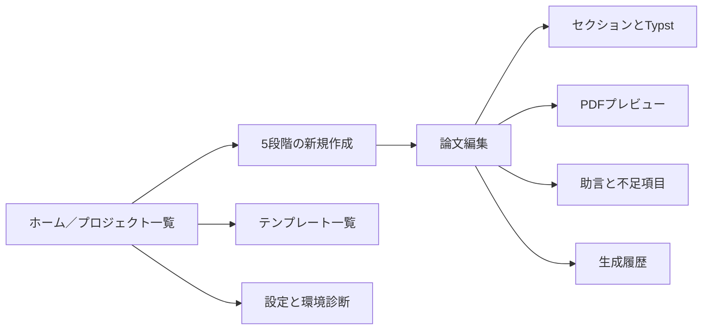

# paper_tools

`paper_tools` は，研究メモと実験情報から論文構成，本文案，Typst原稿，助言，PDFを作成するローカルファーストの論文作成支援アプリケーションである．Windows配布版にはPythonランタイム，依存ライブラリ，Typstを同梱し，利用者による環境構築を不要にする．

> 本ツールは執筆を支援するものであり，研究結果や参考文献の正しさを保証しない．生成された原稿，数値，引用，著者情報は，投稿前に必ず利用者が確認すること．

## 利用者向け：Python不要のWindows版

1. [最新リリース](https://github.com/yuya-0411/paper_tools/releases/latest) から `paper-tools-setup-x64.exe` を取得する．
2. インストーラーを実行し，スタートメニューから `paper_tools` を起動する．
3. ブラウザで論文作成画面が自動的に開く．
4. 終了するときは，Windowsの通知領域にあるpaper_toolsアイコンから「終了」を選ぶ．

Python，pip，仮想環境，Typstの個別インストールは不要である．原稿，SQLite，PDFは利用者ごとのローカルデータディレクトリに保存され，インストール先や一時展開先には置かれない．初期の未署名版ではWindows SmartScreenの警告が表示される場合があるため，GitHub Releasesの配布元と `SHA256SUMS.txt` を確認すること．

配布物には，Python本体，収録されたPythonパッケージ，Typst，ブラウザ内ライブラリのライセンス文書も同梱する．

GitHubの「Source code」ZIPは開発用ソースであり，一般利用者向けアプリではない．インストール不要の持ち運び版が必要な場合は，同じリリースの `paper-tools-windows-x64.zip` を展開し，`paper_tools.exe` を実行する．

## 開発者向け：ソースから起動

```console
python -m venv .venv
# Windows PowerShell: .\.venv\Scripts\Activate.ps1
# Linux/macOS: source .venv/bin/activate
python -m pip install -e ".[dev,desktop]"
paper-tools doctor
paper-tools init-db
paper-tools launch
```

`paper-tools launch` は開発時の起動コマンドである．起動済みの同一アプリを再利用し，準備完了後にブラウザを開く．`START_PAPER_TOOLS.cmd` もソース取得者向けの互換起動手段として残すが，一般利用者には自己完結Windows版を推奨する．

静的な [配布ページ](site/index.html) はGitHub Pages向けであり，GitHub Releasesのインストーラーへ案内する．Pages上では論文処理や研究データ保存を行わない．詳しい構成は [docs/launching-and-pages.md](docs/launching-and-pages.md) を参照する．

## 1．プロジェクト概要

利用者はブラウザの段階式フォームへタイトル，著者，研究目的，背景，手法，実験，結果，指示，図表，データ，参考文献を入力する．アプリは入力を `PaperSpec` へ正規化し，論文構成とセクション本文を生成して独自テンプレートへ反映する．入力されていない事実は補完せず，検索しやすいプレースホルダーと助言として残す．

保存先はローカルのSQLiteとデータディレクトリである．アカウント，クラウド，Docker，有料APIは必須ではない．

## 2．画面構成



デスクトップの編集画面は，左のセクション一覧，中央の本文編集，右のPDF・助言・入力・履歴タブで構成する．狭い画面では1カラムのタブ表示へ切り替わる．HTMXによる部分更新を使い，ページ全体の不要な再読込みを抑える．

## 3．主な機能

- 日本語と英語の論文プロジェクト作成
- 8種類の独自Typstテンプレート
- 簡易メモまたは詳細入力からの構成・本文生成
- 外部LLM不要の決定論的なルールベース生成
- OllamaとOpenAI互換APIの任意利用，失敗時のルールベースfallback
- セクション編集，再生成，自動保存，手動保存，履歴復元
- 本文を保持する構成だけの再生成，選択範囲の文章変換，原稿全体の日英翻訳
- Typstソース表示・編集・ダウンロード
- Typst CLIによるPDF生成とブラウザ内プレビュー
- 図，表，データ，実験，評価指標，引用，論理構成の助言
- PNG，JPEG，SVG，PDF，CSV，JSON，TXT，YAMLの安全なアップロード
- Hayagriva互換YAMLを中心とした参考文献管理とBibTeX入出力
- プロジェクト一式のZIPエクスポート

## 4．Typstを採用する理由

Typstは論文本文とスタイルを分離しやすく，読みやすい原稿記法と高速なコンパイルを提供する．`main.typ`，`sections/`，`references.yml`，`figures/`，`data/` という単純な構成を保ちやすく，ブラウザフォームから生成した内容も人が直接編集できる．本プロジェクトはLaTeXを主要原稿形式にせず，Typstを正式形式とする．

Windows配布版は公式Typst CLIを同梱するため，追加導入なしでPDFを生成できる．ソースから起動する開発環境では，PDF生成時にローカルのTypst CLIを使用する．

## 5．必要環境

- Windows 10または11のx64環境
- 対応ブラウザ．現在のFirefox，Chromium系を想定
- 任意機能としてOllama，またはOpenAI互換API

Python，Typst，Node.js，Docker，React，Vue，Electronは利用者側に不要である．標準機能はインターネット接続なしで動作する．開発者がソースから実行する場合だけPython 3.11以上を必要とする．

## 6．インストール

通常利用はGitHub ReleasesのWindowsインストーラーを使用する．ソースからの開発環境は次のとおりである．

```bash
python -m pip install -e ".[dev]"
pre-commit install
```

CLIを確認する．

```bash
paper-tools --help
paper-tools --version
```

## 7．Typstの確認

```bash
typst --version
paper-tools doctor
```

`paper-tools doctor` はPython，SQLite，データディレクトリ，書込み権限，Typst CLIと版，テンプレート，データベース，任意プロバイダーを診断する．Windows配布版では同梱Typstが自動選択される．上記コマンドはソースから開発するときの確認用である．

## 8．起動方法

```bash
paper-tools launch
paper-tools launch --no-browser
paper-tools serve
paper-tools serve --host 127.0.0.1 --port 8000
paper-tools serve --reload
```

既定のURLは `http://127.0.0.1:8000` である．`--reload` は開発時だけ使用する．LANやインターネットへ公開する用途では，認証，TLS，リバースプロキシ，運用監視を別途設計する必要がある．

利用可能なテンプレートはCLIでも確認できる．

```bash
paper-tools templates
paper-tools templates --format json
```

## 9．初回データベース作成

```bash
paper-tools init-db
```

通常の初回起動でも自動初期化される．明示実行は，保存場所と接続を事前に確認したい場合や運用手順へ組み込む場合に用いる．SQLiteファイルとプロジェクト成果物の既定保存先はユーザー固有のアプリデータディレクトリであり，環境変数で変更できる．

## 10．新規論文作成手順

1. ホームで「新規論文作成」を選択する．
2. 基本情報としてタイトル，言語，論文種別，研究分野，テンプレートを入力する．
3. 著者を追加し，所属，ORCID，連絡著者，表示順を指定する．
4. 簡易メモ，または背景から今後の課題までの詳細情報を入力する．
5. 図表・データを登録し，論文内での用途と出典を記録する．
6. 論文全体とセクション別の執筆指示を指定する．
7. 構成案を生成し，不足情報の助言を確認する．
8. セクションを編集し，Typstソースを生成する．
9. Typstが利用可能ならPDFをコンパイルし，プレビューする．
10. プレースホルダーと参考文献を確認してからZIPを保存する．

CLIから既存プロジェクトをコンパイル，エクスポートできる．

```bash
paper-tools compile <project-id>
paper-tools export <project-id>
```

## 11．テンプレート

| ID | 用途 | 言語 |
|---|---|---|
| `generic-ja` | 日本語標準論文 | 日本語 |
| `generic-en` | 一般的な研究論文 | 英語 |
| `engineering-two-column` | 独自の工学系2段組 | 日本語・英語 |
| `robotics-experiment` | ロボティクス実験 | 日本語・英語 |
| `short-paper` | 4～6ページ程度の短報 | 日本語・英語 |
| `literature-review` | 文献レビュー | 日本語・英語 |
| `research-proposal` | 研究計画書 | 日本語・英語 |
| `experiment-report` | 実験報告書 | 日本語・英語 |

これらは本プロジェクトで独自作成した汎用テンプレートであり，特定学会の公式様式ではない．テンプレートはコードへ埋め込まず，`manifest.yml` とJinja2・Typstファイルで管理する．詳細は [docs/templates.md](docs/templates.md) を参照する．

## 12．日本語・英語生成

日本語は学術論文向けの「である調」と句読点 `，．` を既定とし，`、。` へ変更できる．英語は簡潔なAcademic Englishを既定とし，American EnglishとBritish Englishを選択できる．入力済みの事実と生成文章を内部で区別し，結果のない主張を断定しない．

選択範囲の英文化・日本語化に加え，タイトル，キーワード，全セクションを一括変換する「原稿全体を英語化／日本語化」を用意する．翻訳はLLMプロバイダーが利用可能な場合だけバックグラウンドジョブとして実行し，数値，引用キー，確認用プレースホルダーが変化した応答は採用しない．利用できない場合は通常編集を妨げず，設定方法を画面へ表示する．翻訳時は既存のセクション構成を保持し，対象言語を扱えないレイアウトだけを `generic-ja` または `generic-en` へ切り替える．

## 13．LLMなしで使える機能

ルールベースプロバイダーは外部通信を行わず，入力の正規化，構成案，見出し，本文下書き，Typstソース，不足プレースホルダー，図表・データ助言を決定論的に生成する．次もLLMなしで利用できる．

- プロジェクト，著者，参考文献，ファイルの管理
- セクション編集，自動保存，履歴，復元
- テンプレート選択とTypstレンダリング
- Typst CLIがある場合のPDFコンパイル
- ルールベース助言とZIPエクスポート

## 14．Ollama設定

Ollamaは任意であり，未導入でも正常に動作する．`.env` または設定画面でURL，モデル，タイムアウトを設定する．例：

```dotenv
PAPER_TOOLS_GENERATION_PROVIDER=ollama
PAPER_TOOLS_OLLAMA_URL=http://127.0.0.1:11434
PAPER_TOOLS_OLLAMA_MODEL=llama3.2
PAPER_TOOLS_GENERATION_TIMEOUT_SECONDS=60
```

設定画面で接続状態を確認できる．接続失敗やタイムアウト時は，設定に従ってルールベース生成へ戻る．Ollamaへ送信される範囲は選択した生成処理の入力であり，利用者自身がローカルOllamaの運用範囲を確認する．

## 15．OpenAI互換API設定

任意のOpenAI互換APIは，特定企業へ密結合しない共通プロバイダー経由で利用する．APIキーはSQLiteへ平文保存せず，環境変数で渡す．

```dotenv
PAPER_TOOLS_GENERATION_PROVIDER=openai-compatible
PAPER_TOOLS_OPENAI_COMPATIBLE_BASE_URL=https://provider.example/v1
PAPER_TOOLS_OPENAI_API_KEY=replace-me
PAPER_TOOLS_OPENAI_COMPATIBLE_MODEL=replace-me
PAPER_TOOLS_GENERATION_TIMEOUT_SECONDS=60
PAPER_TOOLS_GENERATION_TEMPERATURE=0.2
PAPER_TOOLS_MAXIMUM_OUTPUT_TOKENS=4000
```

`.env` はGit管理対象外である．外部プロバイダーを選ぶと論文内容が設定先へ送信されるため，画面の警告と提供者のデータ取扱条件を確認する．秘密情報を画面やログへ再表示しない．

## 16．図表・データ助言

助言エンジンは入力と生成原稿を規則で検査し，不足情報，不足データ，図，表，追加実験，比較対象，評価指標，再現性，統計，引用，論理構成，過剰な主張，制約，投稿前確認を提示する．重要度は `required`，`recommended`，`optional` である．

例として，結果があるのに試行回数がない場合，平均値，ばらつき，成功率の記載を求める．装置やセンサが複数登場するのに図がない場合，システム構成図を提案する．助言は研究上の正解ではないため，誤検出は解決済みとして記録できる．

## 17．PDF出力

画面のコンパイル操作，または次のCLIを使用する．

```bash
paper-tools compile <project-id>
```

内部では概ね `typst compile main.typ output/paper.pdf` を，shellを介さない引数配列と有限timeoutで実行する．stdout，stderr，終了コードを保存し，エラー位置を利用者向けに整形する．失敗しても以前の正常PDFを保持する．PDFはブラウザ標準機能でプレビュー・ダウンロードできる．

## 18．ZIP出力

```bash
paper-tools export <project-id>
```

プロジェクト情報，`main.typ`，分割セクション，`references.yml`，図，データ，利用可能なPDFを安全な相対パスでZIPへまとめる．APIキー，アプリ全体のデータベース，プロジェクト外ファイルは含めない．ZIP内の名前はサーバー側で組み立て，パストラバーサルを拒否する．テンプレートZIP取込みは初期版では未実装である．

## 19．テスト

```bash
pytest
pytest --cov=paper_tools --cov-report=term-missing
```

単体テストは設定，データベース，PaperSpec，テンプレート，生成，Typst，助言，プロバイダー，アップロード，履歴，エクスポートを対象とする．Web統合テストはFastAPIのテストクライアントを使用する．実TypstテストはCLIがある場合だけ実行し，未導入環境では明示的にskipする．外部LLMやネットワークへ依存するテストはない．

## 20．Ruff

```bash
ruff check .
ruff format --check .
```

自動整形する場合は `ruff format .` を使用する．広い除外や警告抑止で問題を隠さない．

## 21．mypy

```bash
mypy src
```

サービス，スキーマ，プロバイダー境界をstrict設定で検査する．Webルートは薄く保ち，生成やファイル操作をサービス層へ分離する．

## 22．ディレクトリ構成

```text
paper_tools/
├─ START_PAPER_TOOLS.cmd    ソース開発者向け互換起動
├─ packaging/               自己完結exeとインストーラー定義
├─ scripts/                 初回環境の安全な準備
├─ site/                    GitHub Pages向け静的案内
├─ docs/                    設計文書とADR
├─ examples/                日本語・英語の合成サンプル
├─ migrations/              SQLite schema migration
├─ src/paper_tools/
│  ├─ advisory/             ルールベース助言
│  ├─ models/               SQLAlchemyモデル
│  ├─ providers/            生成プロバイダー
│  ├─ repositories/         永続化境界
│  ├─ schemas/              Pydantic入出力
│  ├─ services/             生成・Typst・資産・出力
│  ├─ templates/            独自Typstテンプレート
│  └─ web/                  FastAPIルート・HTML・静的資産
└─ tests/                   単体・統合・Webテスト
```

実行時の各論文プロジェクトは，`main.typ`，`sections/`，`references.yml`，`figures/`，`data/`，`output/` を必要に応じて持つ．`project.yml` はZIP export時に生成し，編集履歴はSQLiteへ保存する．

## 23．セキュリティ

- アップロード名を信用せず，内部名へ変換し，拡張子，内容，上限を検査する
- 解決後のパスがプロジェクトroot内にあることを確認する
- ZIP Slip，symlink経由の脱出，絶対パスを拒否する
- Typstは `shell=True` を使わず，許可されたプロジェクトだけをコンパイルする
- Jinja2の自動escapeを維持し，CSRF tokenを状態変更要求で確認する
- APIキーをDB，ログ，HTML，ZIPへ保存・表示しない
- 任意URLをサーバー側から無制限に取得しない
- 既定のbind先を `127.0.0.1` とし，外部公開を前提にしない

詳細は [docs/security.md](docs/security.md) を参照する．

## 24．既知の制約

- 論文内容の学術的正しさ，投稿規定への適合，研究倫理上の妥当性は利用者が確認する必要がある．
- ルールベース生成は入力の整理を目的とし，高度な翻訳，校正，意味的な書換えにはLLM設定が必要である．
- Windows配布版はTypst CLIを内蔵するが，原稿が使用するフォントはWindows環境のものを利用する．
- 同梱テンプレートは独自の汎用様式であり，学会公式テンプレートではない．
- 初期版のジョブ管理は単一process向けであり，複数server間の分散実行を扱わない．
- 原稿全体の翻訳は意味的な再構成を行わず，翻訳前のセクションIDと順序を保持する．対象言語の標準構成へ変更する場合は，翻訳後に「構成だけ再生成」を使用する．
- 初期版は認証を持たないローカルアプリであり，信頼できないネットワークへの公開には適さない．
- LLM出力に含まれる不正確な記述を自動的に真実と判定することはできない．
- 作成ウィザードの途中保存はブラウザーのlocalStorageを使用し，添付ファイルは保存しない．
- 初期migration以後の自動schema upgradeとテンプレートZIP取込みは未実装である．
- Projectはtemplate IDを保存するが，template sourceのsnapshotとversion固定は未実装である．同梱templateの破壊的変更は避ける必要がある．
- Uploadは1ファイル単位で検査するが，HTTP request全体の厳密な総量制限にはreverse proxyが必要である．

## 25．今後の拡張

- CSVからのグラフ候補とTypst表生成
- 図番号，本文参照，未使用参考文献の整合性検査
- 文字数，単語数，ページ数，完成度の可視化
- 用語統一，日本語句読点，略語初出，主張と結果の対応検査
- PDFページの軽量サムネイル
- 独自テンプレートのZIP取込みと検証強化
- プロジェクト情報のJSON入出力
- 査読コメント対応，概要，タイトル，キーワードの生成支援
- Cover LetterとResponse to Reviewersの支援
- 認証とprocess外job queueを追加した研究室内server運用profile

## 開発者向け確認

```bash
ruff check .
ruff format --check .
mypy src
pytest --cov=paper_tools --cov-report=term-missing
python -m build
paper-tools --help
paper-tools doctor
paper-tools init-db
paper-tools templates
```

設計の詳細は [docs/specification.md](docs/specification.md)，[docs/architecture.md](docs/architecture.md)，[docs/development-plan.md](docs/development-plan.md) を参照する．
