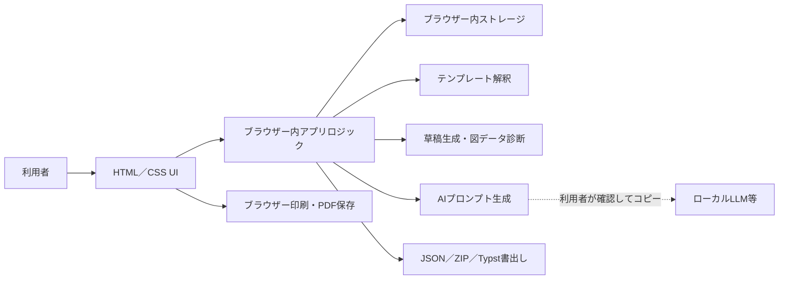

# アーキテクチャ

## 目的

`paper_tools` は，インストールやローカルサーバーなしで論文作成支援を利用できる静的ブラウザーアプリである．配布物はHTML，CSS，JavaScript，画像などの静的ファイルだけで構成する．同じファイルをローカルの `file://` とGitHub PagesのHTTPSから利用できる設計とする．

## 設計原則

- Python，Node.js，データベースサーバー，ビルド処理を実行時に要求しない．
- 主要機能をブラウザー内で完結させる．
- 原稿データを既定で外部送信しない．
- 自動保存だけに依存せず，JSONとZIPによる持ち出し可能なバックアップを用意する．
- `file://` とGitHub Pagesの両方で動くよう，資産参照には相対パスを使用する．

## コンポーネント

### 表示層

画面遷移，入力フォーム，保存状態，助言，プレビューをHTMLとCSSで表示する．ユーザー入力をHTMLとして直接解釈せず，安全なテキストとして描画する．

### アプリケーション層

プロジェクト作成，入力の正規化，構成生成，セクション編集，履歴，ルールベース助言，図・データ診断，プロンプト生成，エクスポートをJavaScriptで処理する．ネットワーク応答を前提としない．重い処理を追加する場合は，UIを停止させないようWeb Workerへの分離を検討する．

### テンプレート解釈

選択されたJSON，Markdown，TXT，Typst，LaTeX，HTMLをブラウザー内で読み，見出し，言語，段組，必要入力を推定する．入力はサイズ・形式・節数を制限し，スクリプトやマークアップを実行せず，正規化した構成定義だけを登録する．カスタム構成で作るプロジェクトには定義のスナップショットを埋め込み，登録一覧がない環境へJSON／ZIPを移した場合も構成を維持する．

### 診断とAIプロンプト

図・データ診断は，研究種別，入力済みの研究情報，本文，登録済みの添付を決定論的な規則で照合する派生情報であり，プロジェクトへ固定保存しない．AI作業台は，プロジェクトの選択範囲と診断結果から，英文変換，模擬査読，内容補強，校正，文献調査のプロンプトを生成する．通信機能を持たず，生成結果の確認，コピー，テキスト保存までを担当する．

### 永続化層

プロジェクトと設定はブラウザー内ストレージへ保存する．カスタムテンプレートの正規化済み定義は設定へ保存し，それを使うプロジェクトにも定義を保持する．入力の連続中は保存処理をまとめ，保存中，保存済み，保存失敗を画面へ表示する．ブラウザー内ストレージは同期サービスではないため，環境間の移動にはJSONまたは添付ファイルを含むZIPを使用する．どちらもアプリの読込み画面から復元できる．

### エクスポート

- JSONは構造化された本文・設定のバックアップと復元に使用する．添付ファイル本体は含めない．
- ZIPはプロジェクト一式の持ち出し用バックアップに使用する．
- JSONとZIPは100 MB・2,048エントリー以内という共通の読込み可能範囲を守り，範囲外の不完全なバックアップは作成しない．
- Typstソースは外部のTypst環境で編集・コンパイルできる形式として書き出す．
- PDFは表示中の原稿をブラウザーの印刷機能で保存する．

## オリジンと保存領域

`file://` で開いたアプリとGitHub Pages上のアプリは，ブラウザーから別の保存領域として扱われる．PagesのURL，ブラウザー，プロファイル，端末が変わった場合も自動的には共有されない．アプリはこの境界を越えてデータを同期しない．

ブラウザーや設定によっては `file://` の保存動作が制限されることがある．継続利用ではGitHub Pagesを使い，重要な変更後にバックアップを作成する運用を推奨する．

## ネットワークと秘密情報

静的サイトには秘密情報を保持できるサーバー領域がない．JavaScriptへ埋め込んだAPIキーは閲覧者から確認できるため，APIキーを必要とするライブLLM連携は行わない．主要機能はルールベースで動作し，原稿を無断で外部へ送信しない．AI用途では，送信機能の代わりに利用者が内容を確認できるプロンプトを生成する．

## PDFとTypstの境界

ブラウザー版はネイティブコマンドを起動できないため，Typst CLIを実行しない．`.typ` の生成と書出しまでを担当し，Typstとしてのコンパイルは利用者が選んだ外部環境の責務とする．アプリ内PDFはブラウザーの印刷・PDF保存を使用する．

## 配布

ローカル利用ではリポジトリを展開して `index.html` を開く．GitHub Pagesでは `.github/workflows/pages.yml` が公開対象の `index.html`，`assets/`，`scripts/` だけを一時ディレクトリへ集めて配信する．アプリ自体のビルド成果物やサーバープロセスは存在しない．
