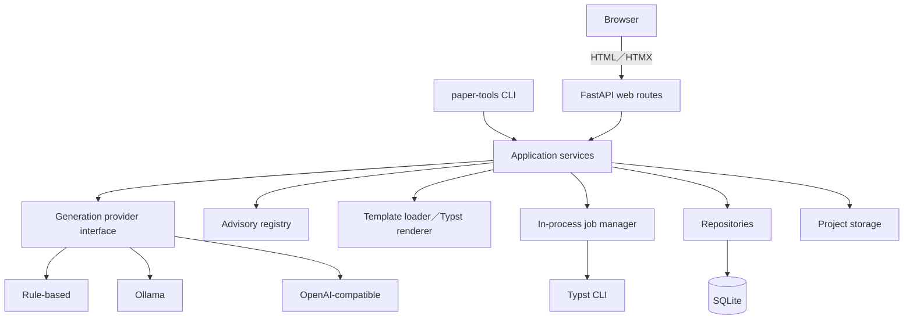
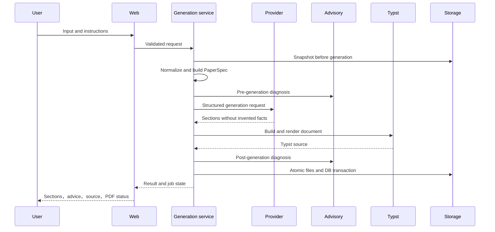
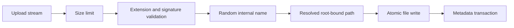

# Architecture

## 1．System構成

BrowserとCLIは同じapplication serviceを利用する．routeはrequestのdecode，認可相当のlocal boundary／CSRF検査，responseのformatだけを担当し，generation，filesystem，provider，Typstを直接実装しない．

## 2．Component責務

| Component | 責務 |
|---|---|
| `config` | Pydantic Settings，environment，安全なdefault |
| `database`／`models` | SQLAlchemy engine，schema，transaction，timestamp |
| `repositories` | Project，section，version，advice，referenceの永続化 |
| `schemas` | Web／service境界のPydantic modelとenum |
| `services.projects` | project lifecycle，wizard，autosave，snapshot |
| `services.planning` | input normalization，PaperSpec，outline |
| `services.generation` | provider orchestrationとfallback |
| `services.advisory` | rule registry実行と解決状態の統合 |
| `services.typst_renderer` | document modelからtemplate render |
| `services.typst_compiler` | Typst検出，command，timeout，result |
| `services.assets` | upload検証，safe name，metadata |
| `services.references` | YAML／BibTeX，key整合性 |
| `services.export` | project ZIPとdownload |
| `services.jobs` | 小規模な非同期job状態と二重実行防止 |
| `providers` | rule-based，Ollama，OpenAI互換，mock |
| `web` | FastAPI route，Jinja2 view，HTMX partial，static asset |

## 3．Data flow

Provider失敗時は，requestがfallback許可ならrule-based providerを実行し，run recordへfallbackとerror summaryを残す．部分的なDB更新や壊れた`main.typ`を公開しない．

## 4．Database

SQLiteはapplication metadataのsource of truthである．主要modelはProject，Author，PaperSpec，Section，SectionVersion，Template，ProjectAsset，Reference，GenerationRun，GenerationInstruction，PaperAdvice，CompileResult，ApplicationSettingである．主要tableは作成・更新日時を持ち，複数recordを変更するoperationはtransactionで囲む．

Binary assetと生成sourceはproject directoryへ保存し，DBにはsafe relative path，hash，metadataを保存する．この分離により大きなblobでDBを肥大化させず，export可能なproject layoutを維持する．初期schema用Alembic revisionを同梱するが，0.1では起動時の不足table作成にSQLAlchemy metadataを使い，revision以後の自動upgradeは未実装である．

## 5．Generation処理

Pipelineはnormalization，PaperSpec，preflight advice，outline，section generation，Typst document，template rendering，optional compile，postflight adviceに分割する．各段階はtyped modelを受け渡し，routeやproviderにfilesystem accessを与えない．詳細は [generation.md](generation.md) を参照する．

## 6．Typst処理

Rendererはtemplate resourceとdocument modelを使い，styleとbodyを分離し，section fileと`main.typ`を生成する．Project内のTypst pathはOSにかかわらず `/` を使う．Compile serviceは許可されたproject rootを `--root` 相当の境界として，`shell=False`，argument array，timeoutでTypstを実行する．成功時は一時PDFを原子的に公開し，失敗時は既存PDFを維持する．

## 7．File保存

利用者のoriginal nameは表示metadataとしてのみ保持する．保存・download・ZIP entryはsafe relative pathから組み立て，absolute path，`..`，drive prefix，symlink escapeを拒否する．

## 8．Jobとfailure recovery

初期版は単一process内のjob registryと`asyncio`を使う．状態は `idle`，`planning`，`generating`，`rendering`，`compiling`，`completed`，`failed`，`cancelled` である．Project IDごとのlockで二重生成を防ぎ，HTMX pollingが状態を取得する．DBにも最終状態，progress，errorを保存し，再起動時に残ったrunning stateをfailedへ回復する．

## 9．Extension point

- `TextGenerationProvider` 実装の追加
- Advisory ruleとtemplate別rule setの登録
- manifest付きtemplate packageの追加
- Repository implementationと将来のDB変更
- Compile backendやpreview rendererの追加
- process外job queueへのJobManager差替え
- Export formatの追加

主要判断は [adr](adr) に記録する．
