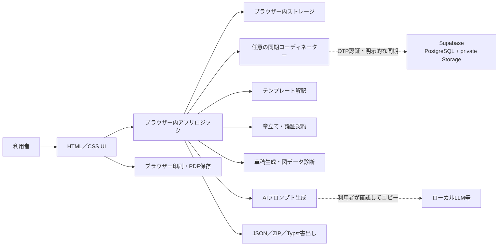

# アーキテクチャ

## 目的

`paper_tools` は，インストールやローカルサーバーなしで論文作成支援を利用できる静的ブラウザーアプリである．配布物はHTML，CSS，JavaScript，画像などの静的ファイルだけで構成する．同じファイルをローカルの `file://` とGitHub PagesのHTTPSから利用でき，HTTPS版では任意のSupabase同期を有効化できる設計とする．

## 設計原則

- Python，Node.js，データベースサーバー，ビルド処理を実行時に要求しない．
- 主要機能をブラウザー内で完結させる．
- 原稿データを既定で外部送信しない．
- ログインと同期を任意機能とし，初回ログインだけで端末内原稿を送信しない．
- クラウド更新はサーバー管理の版番号で競合を検出し，自動上書きしない．
- 章の論証整理データと公表原稿を分離し，明示的な編集なしに相互へ混入させない．
- 自動保存だけに依存せず，JSONとZIPによる持ち出し可能なバックアップを用意する．
- `file://` とGitHub Pagesの両方で動くよう，資産参照には相対パスを使用する．

## コンポーネント

### 表示層

画面遷移，入力フォーム，保存状態，助言，プレビューをHTMLとCSSで表示する．ユーザー入力をHTMLとして直接解釈せず，安全なテキストとして描画する．

### アプリケーション層

プロジェクト作成，入力の正規化，構成生成，章編集，論証契約，履歴，ルールベース助言，図・データ診断，プロンプト生成，エクスポートをJavaScriptで処理する．端末内保存はネットワーク応答を待たずに完了する．クラウド通信は別状態として扱い，失敗しても端末内編集を継続できる．重い処理を追加する場合は，UIを停止させないようWeb Workerへの分離を検討する．

### テンプレート解釈

選択されたJSON，Markdown，TXT，Typst，LaTeX，HTMLをブラウザー内で読み，見出し，言語，段組，必要入力を推定する．入力はサイズ・形式・節数を制限し，スクリプトやマークアップを実行せず，正規化した構成定義だけを登録する．カスタム構成で作るプロジェクトには定義のスナップショットを埋め込み，登録一覧がない環境へJSON／ZIPを移した場合も構成を維持する．

### 章立てと論証契約

プロジェクトschema v2では，`manuscript.sections`を順序付きの章立てとして扱う．各章は安定したID，見出し，本文，更新日時に加え，`chapterContract`を持つ．`chapterContract`は問題，既存研究または前章の不足，提案，仮説，仮説を支える実験・解析，結果から支持できる結論，限界，博士論文全体への一文の回答という固定8項目である．プロジェクト全体の問いは`research.centralResearchQuestion`へ保持する．

`manuscript.outlineCustomized`が真のプロジェクトでは，保存済みの章順と削除をテンプレートより優先する．schema v1の既存プロジェクトは，本文と追加章を保持したまま空の論証契約を補ってv2へ正規化する．同じIDの重複，危険なプロパティ名，章数・見出し・各項目の上限は正規化層で除去または制限する．

「論証契約」は執筆上の対応関係を整理する内部メモであり，法的契約，査読結果，研究倫理上の承認，検証済み証拠ではない．草稿生成は章本文を生成しても論証契約を本文へ挿入せず，既存の契約値を保持する．Typstと印刷HTMLも章本文だけを出力する．JSON／ZIPは復元のため論証契約を含む．

### 診断とAIプロンプト

図・データ診断は，研究種別，入力済みの研究情報，本文，登録済みの添付を決定論的な規則で照合する派生情報であり，プロジェクトへ固定保存しない．AI作業台は，プロジェクトの選択範囲と診断結果から，英文変換，模擬査読，内容補強，章の深掘り・肉付け，校正，文献調査のプロンプトを生成する．通信機能を持たず，生成結果の確認，コピー，テキスト保存までを担当する．

章の深掘りは常に単一章スコープとし，対象章の本文・論証契約と全体の中心研究課題だけを資料データにする．別章，著者，参考文献，添付，履歴，Typstソースは暗黙に含めない．入力中の命令文は信頼されていない資料文字列としてJSONへ隔離し，根拠のない数値・結果・実験・文献を作らない条件を付ける．生成した案は自動適用せず，利用者が確認してコピーする．

### 永続化層

プロジェクトと設定は最初にブラウザー内ストレージへ保存する．章立て，中心研究課題，論証契約もプロジェクトの一部として同じ端末保存経路を使う．カスタムテンプレートの正規化済み定義は設定へ保存し，それを使うプロジェクトにも定義を保持する．入力の連続中は保存処理をまとめ，端末保存とクラウド同期を別の状態として表示する．同期メタデータは原稿JSONへ混ぜず，所有者IDで分離したsidecarへ保持する．クラウドを使わない環境間移動にはJSONまたは添付ファイルを含むZIPを使用し，どちらもアプリの読込み画面から復元できる．

### 任意のクラウド同期

HTTPS版だけがSupabase Auth，PostgreSQL，private Storageへ接続する．メールOTPで認証し，ブラウザーにはPublishable keyだけを配置する．PostgreSQLとStorageのRLSは`auth.uid()`と所有者を照合し，JavaScriptが別の所有者IDを指定してもアクセスできないようにする．プロジェクト本体からバイナリを除いたJSONはPostgreSQL，添付本体は非公開Storageへ保存する．

クラウド保存は`expected_revision`を渡すRPCで行い，版番号が一致する場合だけ更新する．初回移行，取得，保存はいずれも利用者の明示操作とし，端末版とクラウド版が両方変更された場合は双方を残して解決する．Realtime共同編集や最終更新時刻によるlast-write-winsは行わない．

`save_project`は版番号に加え，現在のpayloadと新しいpayloadの`schemaVersion`を同じUPDATE条件内で比較する．`schemaVersion`がない旧payloadはv1として扱い，新しいpayloadの形式が既存payloadより古い場合は更新せず`conflict`を返す．これにより，ブラウザーキャッシュ等に残った古い公開クライアントが，v2の章立て・論証契約を消すことを防ぐ．明示された不正形式は書込み前に拒否し，既存値が不正な場合も更新条件を偽として安全側に停止する．

長い同期処理では開始時の認証所有者と認証epochを固定し，通信・端末更新・sidecar保存の境界ごとに同じ所有者か検査する．認証が変わった場合は別アカウントの同期情報へ混ぜず停止する．クラウド版を端末へ反映する直前には端末版の指紋と保存時刻を再確認し，IndexedDBの同一トランザクション内でcompare-and-swapする．添付のアップロード応答だけを失った場合は，同じ非公開パスを取得して署名・MIME・サイズ・全バイトが一致するときだけ完了済みとして再開する．

### エクスポート

- JSONは構造化された本文・設定のバックアップと復元に使用する．添付ファイル本体は含めない．
- ZIPはプロジェクト一式の持ち出し用バックアップに使用する．
- 章立てと論証契約はJSON／ZIPの復元データへ含めるが，Typst・印刷HTMLの本文へ自動挿入しない．
- JSONとZIPは100 MB・2,048エントリー以内という共通の読込み可能範囲を守り，範囲外の不完全なバックアップは作成しない．
- Typstソースは外部のTypst環境で編集・コンパイルできる形式として書き出す．
- PDFは表示中の原稿をブラウザーの印刷機能で保存する．

## オリジンと保存領域

`file://` で開いたアプリとGitHub Pages上のアプリは，ブラウザーから別の保存領域として扱われる．HTTPS側の保存領域は`scheme + host + port`のオリジン単位であり，URLのパスは分離境界ではない．したがって`https://USER.github.io/repo-a/`と`https://USER.github.io/repo-b/`は同じIndexedDBを共有する．機密用途では専用カスタムドメイン，または本アプリ専用のGitHubアカウント／Organizationを使う．ブラウザー，プロファイル，端末，またはオリジンが変わると端末内ストレージは共有されない．設定済みのHTTPS版で同じアカウントへログインし，利用者が同期を実行したプロジェクトだけがSupabaseを介して共有される．

ブラウザーや設定によっては `file://` の保存動作が制限されることがある．継続利用ではGitHub Pagesを使い，重要な変更後にバックアップを作成する運用を推奨する．

## ネットワークと秘密情報

静的サイトには秘密情報を保持できるサーバー領域がない．JavaScriptへ埋め込んだ値は閲覧者から確認できるため，秘密のAPIキーを必要とするライブLLM連携は行わない．Supabase同期には公開を前提とするPublishable keyだけを使用し，認可は本人限定RLSで強制する．Secret key，`service_role` key，データベースパスワードは設定処理で拒否する．主要機能はルールベースで動作し，AI用途では利用者が内容を確認できるプロンプトだけを生成する．

## PDFとTypstの境界

ブラウザー版はネイティブコマンドを起動できないため，Typst CLIを実行しない．`.typ` の生成と書出しまでを担当し，Typstとしてのコンパイルは利用者が選んだ外部環境の責務とする．アプリ内PDFはブラウザーの印刷・PDF保存を使用する．

## 配布

ローカル利用ではリポジトリを展開して `index.html` を開く．GitHub Pagesでは `.github/workflows/pages.yml` が公開対象の `index.html`，`assets/`，`scripts/`，設定手順，SQLスキーマを一時ディレクトリへ集めて配信する．アプリ自体のビルド成果物やサーバープロセスは存在しない．
